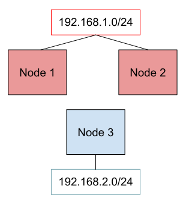
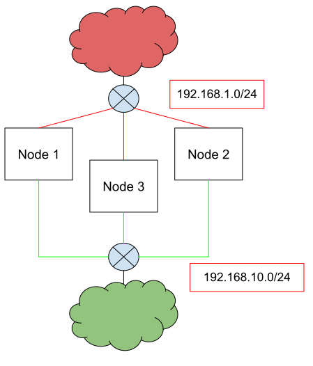
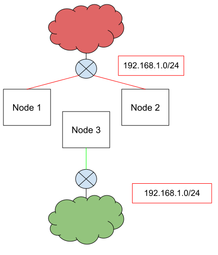

# Address Pool configuration options

## Summary

Following @johananl's initiative in [this issue](https://github.com/metallb/metallb/issues/630)
this enhancement tries to collect and classify various configuration enhancement requests
requested over time.

## Motivation

The way advanced users consume MetalLB is evolving and exposed a need for more complex configuration.
For example, the need for isolation and multi-tenancy induced requests for being able to advertise some specific address pools from a subset of the nodes, or
to allocate them only to a specific namespace, to mention some.

### Goals

* Collect and classify all the requests coming from different issues, in order to have a better understanding
  and an organic implementation, avoiding focus on and implementation of only a specific feature, risking causing conflicts afterwards.
* Provide a list of the possible configuration enhancements and highlight dependencies and conflicts among them (if any).
* Highlight the cases where the solution must be BGP or L2 specific

### Non-Goals

* Covering only a specific use case.
* Providing a L2 only or BGP only solution where the problem might be expressed in a more generic way.

## Proposal

For all the IPs belonging to an address pool, we need to address three main configuration degrees:

* Announcing the IP from a subset of nodes
* Announcing the IP to a subset of BGP neighbors
* Using a given AddressPool only for a subset of services

The general idea of this proposal is that these configuration degrees are all related to the AddressPool object, and
that these configurations are independent between each other.

### Announcing the IP from a subset of nodes

The most common request is being able to associate a given pool to a subset of nodes (which translates to selecting a subset of speakers so that these speakers - and only them - announce the IP).

This covers use cases where different set of nodes are exposed to different subnets, and the loadbalancer IP can be reached only via a subset of the nodes.

[](./images/ip_per_node.svg)

This was raised in the following issues / PRs:

* [Issue: L2 Mode on k8s workers on different L2 segments](https://github.com/metallb/metallb/issues/511)
* [PR: Address Pool with node selector filtering](https://github.com/metallb/metallb/pull/502)
* [Issue: Layer 2: impossible to use MetalLB on a subset of Kubernetes nodes](https://github.com/metallb/metallb/issues/302)
* [Issue: Layer2 Different subnets(label for LB, check for interface](https://github.com/metallb/metallb/issues/737)
* [Issue: Look into a generic pool <> node affinity mechanism](https://github.com/metallb/metallb/issues/630)
* [PR: MetalLB speakers working on a subset of nodes in layer2](https://github.com/metallb/metallb/pull/613)
* [Issue: Annotate nodes with address pool/weighted address pools](https://github.com/metallb/metallb/issues/941)

### Announcing the IP to a subset of BGP neighbors

With the exception of the BGP peer [node selector](https://metallb.universe.tf/configuration/#limiting-peers-to-certain-nodes), an IP assigned to a Service
is currently advertised to all the configured BGP peers.

This is described in:

* [Issue: BGP peers per address-pool](https://github.com/metallb/metallb/issues/521)
* [PR: Limit announcement of address pools to specific BGP peers](https://github.com/metallb/metallb/pull/596)

Given the IP, here we want to choose what BGP peers it must be announced to:

[](./images/pool_peer_selector.svg)

On top of that, different nodes must announce the IP to a different set of BGP peers:

[](./images/pool_peer_node_selector.svg)

#### No announcement

This a degenerate case that was suggested by [this discussion](https://github.com/metallb/metallb/pull/832#issuecomment-888897400) where
there are scenarios in which only the IP pooling side of metallb is used, but the routes to those IPs are set statically.

On top of that, Calico suggests to deploy MetalLB without the speakers to leverage only the allocation feature exposed by the controller in
[its official documentation](https://docs.projectcalico.org/networking/advertise-service-ips).

### Using a given AddressPool only for a subset of services

Currently, the options to make sure a given service is using a specific IP from a specific pool are:

* using the `metallb.universe.tf/address-pool` annotation on the service
* using the `auto-assign: false` parameter on the pool, and then statically assign the IP to a given service.

From this point of view, we can enhance the allocation logic allowing users to reserve a given pool for a set of namespaces or for a set
of services. This is more flexible and moves the focus on the cluster administrator, who is setting the MetalLB configuration
in a multi tenant scenario.

This, in combination with the other configuration degrees above, will provide a way to have per service (or per namespace) behavior
 (i.e. specifying the communities for a given service).

The issues related to this arguments:

* [Issue: Pool affinity for Namespace](https://github.com/metallb/metallb/issues/383)
* [Issue: Feature request: addresses assignment outside of Service definition](https://github.com/metallb/metallb/issues/616)
* [Issue: allow selecting services to announce with the bgb speaker](https://github.com/metallb/metallb/issues/604)
* [Issue: Dynamic BGP communities from services](https://github.com/metallb/metallb/issues/934)

### Risks and Mitigations

#### Conflicts with the current implementation

The only current configuration option that will collide with what is being described here is the BGP peer node selector.

Despite some overlap, it seems reasonable to maintain both filters and the only risk will be that if there is no intersection between filters,
the service won't be advertised. No risk of non-deterministic behavior seems to be present.

#### Bad configuration

##### Service allocation

When a user specify both a pool to be allocated to a specific service and one with no selector, the service may receive an IP from the broader one.
We need to implement an easy to understand and deterministic behaviour (see design details below).

##### Non overlapping filters

Having an IP with no nodes advertising it is a risk. Some scenarios are:

* Traffic Policy Local with pods not running on the same nodes selected by the selector
* Node BGP peer selector with no intersection with the address selector

It should be possible to detect non overlapping configurations, and raise an event when they happen. The metallb operator introduces a Validation WebHook
that can be used to prevent those configurations to be created in first instance.

### Conflicts with discovery

The peer discovery feature currently being implemented in [this PR](https://github.com/metallb/metallb/pull/593) will introduce a way to
fetch peers from the node's annotations.

In order to be able to select them, the current proposed structure

```yaml
from-annotations:
      - my-asn: example.com/local-asn
        peer-asn: example.com/remote-asn
        peer-address: example.com/address
```

will need to be extended with a name field (as much as the `peers` substructure) so it can be selected.

### Conflicts with the FRR implementation

All the BGP changes will happen from a "behavioural" point of view. Where needed, the changes will reflected in both the native and the new implementation.

### Not covering all the angles

The risk of not covering all possible cases / permutations is still there. For example, the proposed solution leverages pool customization to provide a
way to set per service specific properties (i.e. define an AddressPool with bgp-communities and associate it to a single service), while a user may want to
set custom properties only on one single service.

That aside, this proposal covers the majority of the issues that were raised by the users (multiple times), and it won't prevent to add a finer level of configuration
if ever comes the need.

## Design Details

### Announcing the IP from a subset of nodes

Extending the address-pool object with an optional node selector field is straightforward:

A configuration would look like:

```yaml
    peers:
    - peer-address: 10.0.0.1
      peer-asn: 64501
      my-asn: 64500
      name: foo
    - peer-address: 10.0.0.1
      peer-asn: 64501
      my-asn: 64500
      name: bar
    address-pools:
    - name: default
      protocol: bgp
      addresses:
      - 198.51.100.0/24
      nodeSelector:
        matchLabels:
          network: first
          network: second
```

#### Implementation

The [current implementation](https://github.com/metallb/metallb/blob/312b03cd3065687f25274486cd3ff5c79d6f6068/speaker/layer2_controller.go#L45) announces L2 pools only from those nodes
with a running speaker and an active endpoint for the service.

Implementing the address-pool / node association will be only reflected in a change in the `ShouldAnnounce` logic, eventually extending its signature with all the information needed to understand if the speaker must announce the IP or not.

### Announcing the IP to a subset of BGP neighbors

In order to be able to select a specific set of peers for a given pool we need to:

* add a `name` field to the `Peer` structure so it can be selected by an AddressPool
* add an optional list of bgp-peers, each one with its own (optional) node selector

A configuration with bgp peer selection only would look like:

```yaml
    peers:
    - peer-address: 10.0.0.1
      peer-asn: 64501
      my-asn: 64500
      name: foo
    - peer-address: 10.0.0.1
      peer-asn: 64501
      my-asn: 64500
      name: bar
    address-pools:
    - name: default
      protocol: bgp
      addresses:
      - 198.51.100.0/24
      bgp-peers:
        - name: foo
        - name: bar
```

A configuration where bgp selection and nodes allocation would look like:

```yaml
    peers:
    - peer-address: 10.0.0.1
      peer-asn: 64501
      my-asn: 64500
      name: foo
    - peer-address: 10.0.0.1
      peer-asn: 64501
      my-asn: 64500
      name: bar
    address-pools:
    - name: default
      protocol: bgp
      addresses:
      - 198.51.100.0/24
      bgp-peers:
        - name: foo
        nodeSelector:
          matchLabels:
            network: first
        - name: bar
        nodeSelector:
          matchLabels:
            network: second
```

#### Implementation

A service using an IP from a pool with a list of bgp-peers will not advertise the IP to peers outside that list.

The BGP controller already contains a mapping between services and their BGP advertisement parameters taken from the address pool configuration.

The structure is being filled [here](https://github.com/metallb/metallb/blob/5d236989e61683daf1eaad00777b81ce7dd98c5d/speaker/bgp_controller.go#L218).

The idea here is to extend that with the list of peers that IP must be advertised to. In case the peer comes with a node selector, extra logic on the current node and the node selector will be in place to understand if to put the peer in the list of not.

#### Not announcing the IP

A new `none` value for the protocol will be introduced.

```yaml
    address-pools:
    - name: default
      protocol: none
      addresses:
      - 198.51.100.0/24
```

In this scenario, the pool will be used to assign the IP to a given service, but no advertisement will made.

### Using a given AddressPool only for a subset of services

The idea is to be able to reduce the scope of a particular AddressPool to a set of namespaces and services.

```yaml
    address-pools:
    - name: default
      protocol: bgp
      addresses:
      - 198.51.100.0/24
      allocate-to:
        priority: 50
        namespaces:
          - namespaceA
          - namespaceB
        labelSelector:
          matchLabels:
            tenant: foo
```

Both the namespaces and the label selector are optional.

The controller will use the pool with highest priority in case of multiple matches. This is deterministic and will make the behaviour more clear to the users.

Open question: what to do in case a selective pool finishes the IPs? As a user, if I choose a given pool from my services, I'd rather not have the IP assigned than getting one
from another pool. One alternative is to keep this as default (i.e. if allocate-to is set and no IPs are available, do not go to the next pool). Another option is to have another
flag that overrides this behaviour.

#### Implementation

The changes will happen around the `Allocate` [function](https://github.com/metallb/metallb/blob/997a177a762c6c8215ca9438083545529b675376/internal/allocator/allocator.go#L266).


### Impacts on the operator

The changes in the basic types will be reflected in the CRDs implemented in the operator.
If / once the CRDs are moved back to metallb itself, the peer selection may include a label selector instead of a bare list of names.

### Test Plan

**e2e tests**:

Every new configuration must be reflected in additional e2e tests that ensure it's quality.

Corner cases that must be covered:

* Node selection: changing the selector
* Peer selection: ensuring that the feature mixes well with the peer node selection
* Peer selection: changing the selector on the fly
* Peer selection: changing the node selector on the fly

**unit tests**:

The code must be covered by unit tests. Especially the selection logic, to have a broader coverage and to understand if the logic is working.

## Drawbacks

This new logic may bring broader complexity while MetalLB is well known to work out of the box.

Besides that, all the additional selectors are optional, and the bare minimum configuration will continue to work.
Power users will be able to leverage this extra configurability for their more complex scenarios.

## Alternatives

The only alternatives are implementing a subset of the proposed configuration options, or no new configurations at all.

## Development Phases

The four different configurations flavours seem to be independent:

* pool node selector
* pool bgp peer selector (with node selector)
* pool namespace / service selector
* no advertisement

On top of that, the bgp peer selector can be split in two different phases, adding the node selection option later.

For this reason, from a development point of view they can be implemented in parallel / one at the time.

In order to declare a given configuration option fully supported, the following items must be covered:

* implementing the feature
* adding test coverage
* aligning the operator CRDs
* extending the documentation
