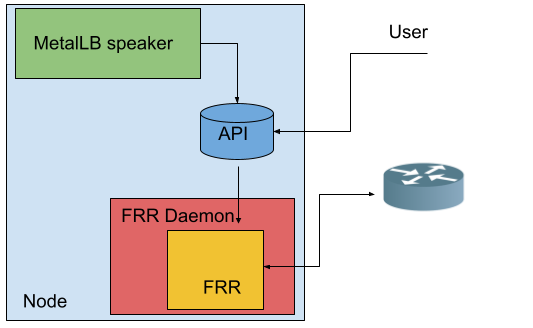
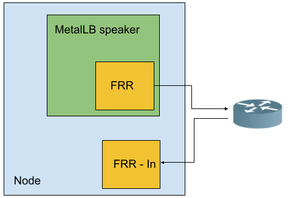
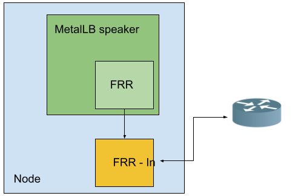

# Split FRR - Proposal to move FRR to a stand alone component

## Summary

MetalLB relies on FRR under the hood, which has way more to offer than "just"
announcing prefixes as MetalLB does. Here we propose to split MetalLB and create
a new, possibly standalone, FRR daemonset with its own API which can be alimented
both by MetalLB but also by other actors.

[](./images/frrdaemonset.png)

## Motivation

There are users who need running FRR (or an alternative implementation) on the nodes for other purpouses, receiving routes from their routers being the
most popular one.

They require receiving routes via BGP for multiple reasons:

- They want to be able to inject routes coming dynamically from other clusters
- When enabling anycast gw in some routers, then bgp peering does not work anymore. Because of this, they require ecmp routes to be able to establish HA in their egress path
- Having a way to configure multiple DCGWs in an active - active fashion allows a better balance of the egress traffic and a quicker failure detection with BFD

MetalLB is meant to announce routes (in particular, to reach Services of type LoadBalancer) only, so it is definetely not the right place to implement a broader FRR configuration.

At the same time, the approach of having a single FRR instance is optimal for both performances and for limiting
the number of open sessions (see more on the _alternatives_ section).

## Goals

- Having a separate FRR component where the user can add its own part of the configuration
- Allowing multiple users (or controllers) to contribute to the configuration in an incremental manner
- Having a cloud native API that allows configuring the subset of the FRR features we want to expose
- Offer a way to experimenting allowing a "do it at your own risk" way to set a raw FRR configuration
- Allowing multiple nodes to have different FRR configurations
- Replacing the FRR based MetalLB implementation with a layer that aliments the API of this new daemon
- Allowing the deployment of this new daemon as a stand alone component not
necessarily tied to MetalLB

## Non Goals

- Covering all the possible FRR configurations. We will start with a limited
API that can be expanded depending on the use case
- Exposing the raw FRR configuration as the way of configuring the daemon. The raw config must serve only as an experimentation tool
- Allowing a configuration to remove the configuration added by another actor. This might not always be possible, but when designing the API, this should always be taken in consideration

## Proposal

### User Stories

#### Story 1

As a cluster administrator, I want to continue using MetalLB with the current allowed API.

#### Story 2

As a cluster administrator, I want to allow FRR to receive routes, but only for a specific prefix.

#### Story 3

As a cluster administrator, I want to deploy only FRR to receive routes, connecting to different peers depending on the nodes.

## Design details

The idea is to have a daemonset, with the pod running on each node, whose pods
have the same structure the speaker pod has today (frr container, reloader, metrics, etc).

The speaker will be provided with a new `frrk8s` bgp mode which will translate the MetalLB api to the new controller's api.
Given that the new api will allow setting the configuration per node basis, each speaker will take care of configuring its own node.

### The API

Before describing the options, we are going to list the properties we want from the API exposed by the FRR Daemonset:

- It must be possible to set a specific configuration per node. In particular, each metallb speaker will configure the instance running on its node
- It must be possible to apply the metallb configuration and the user’s configuration over the same FRR instance (and ideally, any configuration applied by any external component)

Additionally, we may want to enable the following scenarios:

- A user may want to connect to another neighbor
- A user may want to advertise an extra set of IPs for a given neighbor (i.e. the pod’s CIDR)
- A user may want to override the configuration put in place by MetalLB to reject the incoming routes

In order to provide an abstraction of the FRR Configuration, we need to represent the following entities:

The router:

- ASN
- ID
- VRF

For each router, we must specify a neighbor with all the details we have in a session:

- IP
- ASN
- passwords
- bfd profile (if enabled)
- the ips we want to advertise

For each neighbor we must specify the route-map entries, and in particular:

- the list of prefixes we allow FRR to advertise
- the list of prefixes we allow FRR to receive
- the list of prefixes we would set the community to
- the list of prefixes we would set a localpref to when announcing

If we split the configuration in multiple sub-entities (router, neighbor for router, allowed ips for any neighbor), the configuration of a single node becomes spread across multiple rows of multiple entities.

Because of this, a single CRD with substructures is going to provide better
readability and it's going to be easier to reason about.

The spec side of a FRRConfiguration would look like:

```go
type FRRConfigurationSpec struct {
  Routers      []Router
  NodeSelector map[string]string
  RawFRR       string
}

// Router represent a neighbor router we want FRR to connect to
type Router struct {
  ASN        uint32
  ID         string
  VRF        string
  Neighbors  []Neighbor
  PrefixesV4 []string
  PrefixesV6 []string
}

type Neighbor struct {
  ASN                   uint32
  Address               string
  Port                  uint16
  HoldTime              metav1.Duration
  KeepaliveTime         metav1.Duration
  PasswordSecret        v1.SecretReference
  AllowedOutPrefixes    AllowedPrefixes
  AllowedInPrefixes     AllowedPrefixes
  PrefixesWithLocalPref []LocalPrefPrefixes
  PrefixesWithCommunity []CommunityPrefixes
  BFDProfile            string
}

// The default is deny all. AllowAll takes precedence
// to having a few prefixes listed.
type AllowedPrefixes struct {
  Prefixes []string
  AllowAll bool
}

type CommunityPrefixes struct {
  Prefixes  []string
  Community string
}

type LocalPrefPrefixes struct {
  Prefixes  []string
  LocalPref int
}

type BFDProfile struct {
  ReceiveInterval  uint32
  TransmitInterval uint32
  DetectMultiplier uint32
  EchoInterval     uint32
  EchoMode         bool
  PassiveMode      bool
  MinimumTTL       uint32
  Name             string
}

```

This doesn't declare what fields are optional and what are not, but is a good
approximation of the API.

### Merging multiple configurations applied to the same node

Multiple actors may add configurations selecting the same node.
There are configurations that may conflict between themselves, leading to errors.

This include for example:

- different ASN for the same router (in the same VRF)
- different ASN for the same neighbor (with the same ip / port)
- multiple BFD profiles with the same name but different values

Incompatibilities aside, merging is straightforward because all the elements
of the configuration are incremental and allow, for example, to:

- Extend the set of ips we want to advertise to a given neighbor
Adding an extra neighbor with its set of IPs
- Extend the set of ips we want to associate a given community to
- Allow incoming routes for a given neighbor

### Exposing the status

We should be able to expose:

- The rendered frr configuration for each node
- The failure of a given configuration rendering and the reason
- Details about the status of BFD / BGP sessions from one node to each neighbor

Additionally, we might consider either allowing MetalLB to probe directly the
FRR instance or expose the same set of metrics that MetalLB is currently exposing.

### Breaking the node

Applying the wrong configuration / fetching the wrong routes might break the node.
We should have a mechanism in place to avoid getting routes that overlap the pods / service CIDRs and any other sensible route that a cluster might require.

Moreover, we should explore the possibility of having sanity checks for the node and suspend the FRR configuration in that scenario.

### Deployment

This new FRR daemon will live in a separate repo, and ideally it's going to
be deployable on its own.

On the other hand, the MetalLB Operator will be changed so it can deploy this
new component too.
All in one manifests will be provided to deploy both MetalLB and the FRR daemon.

We must also provide a mechanism to ensure that the version of MetalLB and this new daemonset are compatible.

### Testing

#### Unit tests

We will have unit tests for each module that require it, plus

#### E2E tests

We need a comprehensive CI which leverages the same mechanisms as the MetalLB one, in order to ensure the new daemon behaves correctly.

Moreover, we might need a lane that verifies that MetalLB keeps working after changing the FRR daemon. A tradeoff must be made between coverage and the number of lanes we can run together.

## Alternatives

Before coming to this version, a few alternatives were considered.

### Expose directly the FRR configuration

This version still leverages the integration between MetalLB and the FRR daemon via the API, but the API is a raw string where the full FRR configuration can be added.

```go
type FRRConfigurationSpec struct {
  NodeSelector map[string]string
  RawFRR       string
}
```

Merging is problematic and the only way to solve it is by concatenating all the configurations of a given node sequentially.

This has two consequences:

- the users will need to be aware of how MetalLB renders its configuration
- the way MetalLB configures FRR cannot change because it will risk to break
the users' extra configuration

For example, in order to accept all the routes from a given neighbor, a user must be aware that metallb sets a deny rule with a given index and a given name:

```none
route-map 10.2.2.254-in permit 10
```

Despite at first sight this version offers all the flexibility offered by FRR, the configuration is actually trickier because of the reasons mentioned above.

### Running two FRRs

[](./images/2frrs.png)

This potentially allows the user to do what he wants without worrying about what MetalLB does.

However:

- it consumes more resources, both on the nodes and on the routers, in terms of sessions and CPU
- it leads to port conflicts, not all the routers allow to change the ports and FRR currently does
not allow overriding the BFD port

### Cascading MetalLB to a local FRR

[](./images/cascade.png)

In this scenario we would be able to run two instances of frr as one of them would run inside a container.
The connection with the external routers would be handled by the instance running on the host, which would be under direct control of the user.

This would give the user the freedom to apply the configuration they want to the FRR instance running under their control, while MetalLB would be configured to peer with a process running on the host.

The general issue is that MetalLB will see one single peer (the local one) it will announce the routes to, whereas all the rest of the configuration for relying on those routes will be required to happen manually.

This includes:

- Any “per peer” advertisement logic of the service
- Any “per node” bgp pairing
- The configuration per VRF (including limiting the peers paired via VRFs, services announced via VRF, etc)
- The BFD option

Additionally, the problem of how to configure and manage the "local" FRR in a scalable manner still remains unaddressed.

## Development Phases

The ultimate goal is to have the MetalLB CI pass when running with the new "BGP mode".

The phases will look like:

- The new daemon is being developed in a separate repo, with a subset of the API implemented (i.e., establishing the BGP session)
- CI is running with kind with the same matrix we have in MetalLB
- the implementation is moved forward, together with integration tests
- MetalLB implements the new "k8sfrr" bgp mode
- We release an experimental mode where MetalLB relies on the new daemon (and the operator too)
- The daemon repository is enriched with manifests and is available as a stand alone object
- The frr bgp mode is deprecated and all the code is removed from MetalLB
